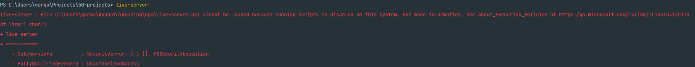

# NFS box hover effect
Generate a random dad joke with a click of a button

# Created with
 1. HTML
 2. SCSS
 3. 7-1 Sass Architecture
 4. npm packages:
    - node-sass
    - live-server
    - css-reset-and-normalize

# How to set up:
Run the following commands in the root directory:
```bash
npm install
```
```bash
 live-server --no-browser --ignore=scss/ .
```
```bash
 npm run css-watch
```

**Important**: whenever you create a new `.scss` file, you need to end the watcher with:
- `ctrl + e` and start it again with:
```bash
npm run css-watch
```

Other commands:
```bash
npm run css-compile
```
- - online compiles the files without the watcher

## Troubleshooting:
### Running scripts is disabled on this system

If you try to run `live-server` you might run into the following error:

`live-server : File C:\Users\gorgo\AppData\Roaming\npm\live-server.ps1 cannot be loaded because running scripts is disabled on this system. For more information, see about_Execution_Policies at https:/go.microsoft.com/fwlink/?LinkID=135170.`



Fix: [link](https://stackoverflow.com/questions/63423584/how-to-fix-error-nodemon-ps1-cannot-be-loaded-because-running-scripts-is-disabl)

- Open PowerShell (Run As Administrator)
- Check the current execution policy using this command
    - `Get-ExecutionPolicy`
    - You should get `Restricted`
- Run this command to make it `Unrestricted`
    - `Set-ExecutionPolicy Unrestricted`
- Check again whether execution policy changed by running this command
    - `Get-ExecutionPolicy`
- You should get `Unrestricted`
- Run `live-server` again

